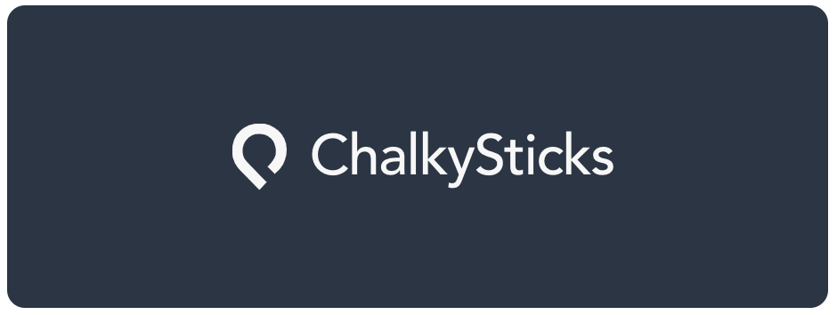

<p align="center">
    <a href="https://www.chalkysticks.com" target="_blank" rel="noopener noreferrer">
        
    </a>
</p>

<br/>

<p align="center">
    <a href="https://github.com/chalkysticks/vue3-components" title="GitHub version">
        
    </a>
    <a href="https://www.patreon.com/mattkenefick" title="Backers on Patreon">
        
    </a>
    <a href="https://paypal.me/polymermallard" title="Backers on Paypal">
        
    </a>
</p>

<br/>

## 🎱 Vue3 Components

> ChalkySticks themed components for Vue3 / TypeScript platforms


## Installation

Open your terminal and type in

```sh
$ npm install -D @chalkysticks/vue3
```

Use them in your Vue3 project by importing them

```typescript
import { BrandingBadge, BrandingStandard } from '@chalkysticks/vue3';
```

### BrandingBadge

Lorem ipsum dolor ist amet...


```javascript
import { BrandingBadge } from '@chalkysticks/vue3';
```

```html
<div>
    <BrandingBadge size="sm" mode="dark" />
    <BrandingBadge size="sm" mode="light" />
</div>
<div>
    <BrandingBadge mode="dark" />
    <BrandingBadge mode="light" />
</div>
<div>
    <BrandingBadge size="lg" mode="dark" />
    <BrandingBadge size="lg" mode="light" />
</div>
```

### BrandingStandard

Lorem ipsum dolor ist amet...


```javascript
import { BrandingStandard } from '@chalkysticks/vue3';
```

```html
<div class="d-flex">
    <BrandingStandard class="background-chalky-white p-3" mode="dark" />
    <BrandingStandard class="background-chalky-blue p-3" mode="light" />
</div>
```


## Bugs

If you have questions, feature requests or a bug you want to report, please click [here](https://github.com/chalkysticks/vue3-components/issues) to file an issue.

## Author

* [**Matt Kenefick**](https://www.mattkenefick.com/)
<br />
[](https://github.com/mattkenefick)
<br />
[](https://twitter.com/mattkenefick)

## Support

Like what you see? Keep me awake at night by buying me a coffee or two.

<a href="https://www.patreon.com/mattkenefick" target="_blank">
    
</a>

## License

Copyright (c) 2021 Matt Kenefick.

Usage is provided under the MIT License. See [LICENSE](https://github.com/mattkenefick/eloquentjs/blob/master/LICENSE) for the full details.
